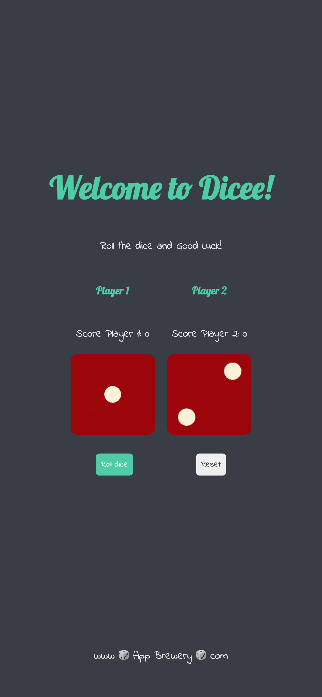

# Dicee - Roll the Dice Game

Dicee is a project where two players can roll the dice and see who is the luckiest. You can use Dicee to roll a six-sided dice online while playing a board game or test your luck against a friend. The purpose of this project was to practice modules with JavaScript.

### Check out Dicee [here](https://dicee-roll-dice.netlify.app)

## Development Process

- Downloading resources from the JavaScript course;
- Sketching the logic as a diagram;
- Development of the user interface from a mobile-first perspective.

## Built with

- Semantic HTML5 markup;
- JS modules;
- Mobile-first workflow.

## Technologies and Tools

- [HTML5](https://html.com)
- [CSS3](https://www.w3.org/Style/CSS/)
- [JavaScript](https://www.javascript.com)

## Requirements

To work with the code, you will need, before you begin, to install in your machine Git and to have a source-code editor such as [VSCode] (https://code.visualstudio.com).

## What I learned

### How to structure a project while working with modules:

- Thinking of the project's architecture, how to organize the components with their own folder, js, and css files;

### Sharpen my skills at making the code reusable and modular:

- Keeping the code organized and working with the separation of concerns so each module has its own responsibility.

~~~
const Button = (type, name, use, action) => {
    const btn = document.createElement("button");
    btn.type = type;
    btn.className = "btn"
    btn.classList.add(use === 'roll' ? 'btnRoll' : 'btnReset');
    btn.textContent = name;
    btn.addEventListener('click', action);
    return btn;
}

export default Button

~~~

### Using spread operator to work with elements of a Node list

~~~
// Spread operator, remove array elements from the node list
[...diceImage].map((image, index) => {
    shakeDice(image);
    if (index === 0) {
        image.src = diceSides[randomDicePOne].source;
    } else {
        image.src = diceSides[randomDicePTwo].source;
    }   
});
~~~

### Practice DOM manipulation:

~~~
const btnBox = document.createElement("div");
const footer = document.querySelector("footer");

titleBox.appendChild(Text("h1", "Welcome to Dicee!"));
titleBox.appendChild(Text("p", "Roll the dice and Good Luck!"));
titleBox.classList.add("titleBox");
~~~

## Useful resources
- [JavaScript Modules – A Beginner's Guide](https://www.freecodecamp.org/news/javascript-modules-beginners-guide/): This article explains what JavaScript modules are and the advantages of their use. In this guide, you can also learn about the difference between export and export default. The author gives us an example CommonJS, a module system created by developers on top of the JS language, since only recently the language gained an official module system.

### Made with :heart: by [Caroline Almeida Nikolic] (https://www.linkedin.com/in/carolinealmeidanikolic/)